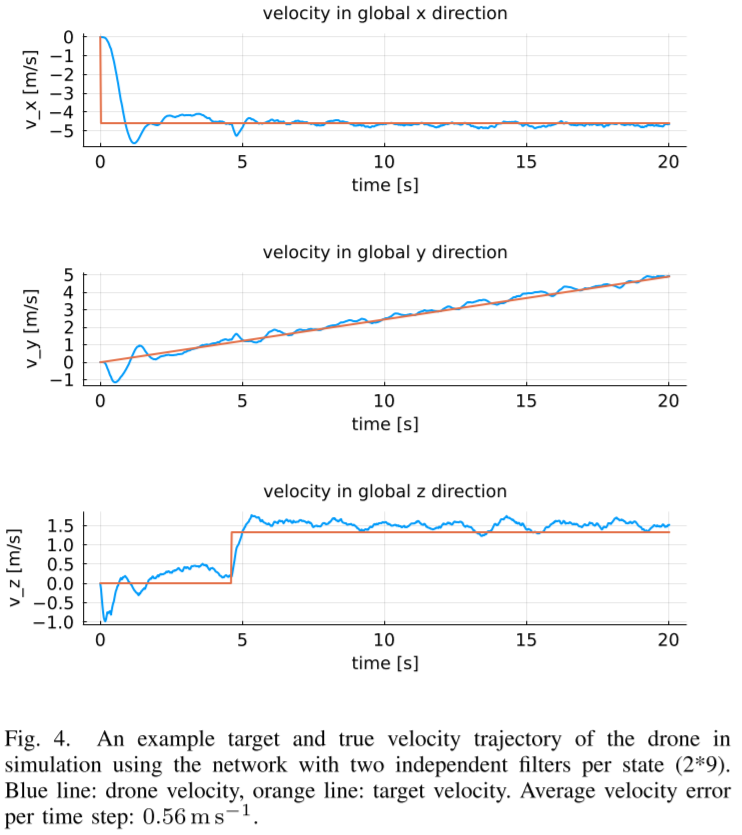
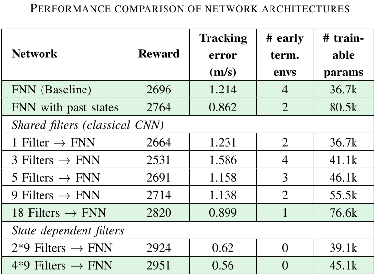

# Advanced Deep Learning for Robotics Project 🤖🚀

This repository includes the results as well as the code for our project in the [Advanced Deep Learning for Robotics](https://bbaeuml.github.io/tum-adlr/adlr/index.html) course at TUM in WS2022/23.

## The project

**Topic**: Development of a reinforcement learning based controller for a vertical take-off and landing drone.

**Abstract**: Developing controllers for Vertical Take-Off and Landing drones is difficult due to the complex underlying dynamics. The goal of this project is to develop a Reinforcement Learning based velocity-tracking controller for such a drone in simulation. The major contributions are to learn a controller for a drone with active wing flaps, to use information about the state history in the controller network and to incorporate gusty conditions in the simulation. As a main result, the tracking performance could be improved significantly compared to baseline by processing the last 0.5s of the state history with state dependent filters and give it as input to the controller. Beyond tracking performance, flight efficiency and stability are improved as well. Due to these benefits and ease of implementation of the network architecture, we suggest to use the presented architecture in future works.

**Full results**: [Final paper](FinalReport-InClassPaper.pdf) and [presentation](FinalPresentation.pdf).

  

  

  

It is clearly visible, that using our approach the trajectory tracking performance of the drone improves significantly. At the same time, the numer of parameters in the neural network only increases slightly. Find details in our [paper](FinalReport-InClassPaper.pdf) and [presentation](FinalPresentation.pdf).

## The code
This repository contains the simulation for the drone as well as the full reinforcement learning pipeline. Use the `src/reinforcement_learning/run_experiment.jl` file to execute the RL-pipeline. This script will start the training process, evaluate the agent on test sets and save the resulting files automatically. Pass parameters to the `run_experiment.jl` file in order to define your experiments. Instructions on how to run the file exactly can be found within the file. Each experiment must have a separat folder in `src/reinforcement_learning`. In this folder must be a `.json`-file that defines the parameters for the experiment. All results for the experiment will be saved in the folder.

The code that defines the RL-pipeline is located in `src\reinforcement_learning`. This project uses the [Julia programming language](https://julialang.org/), which offers much higher performance compared to Python. Find details in the [SETUP.md](SETUP.md). Logging is done with [Tensorboard](https://www.tensorflow.org/tensorboard).

Leave any question as Issue in this repo.

Thanks! ❤️

## Authors
@[chrisnarr](https://github.com/chrisnarr)
@[OliEfr](https://github.com/OliEfr)
@[Finn-Sueberkrueb](https://github.com/Finn-Sueberkrueb)
